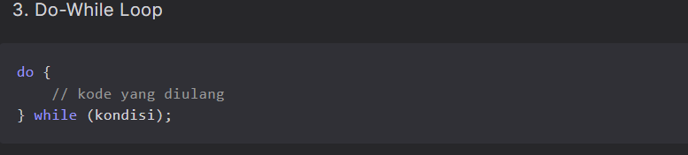

# Laporan Modul 2: Dasar Pemrograman Java
**Mata Kuliah:** Praktikum Pemrograman Berorientasi Objek   
**Nama:** [RAHMAD HIDAYAT]  
**NIM:** [2024573010072]  
**Kelas:** [TI 2E]

---

## 1. Abstrak
Ringkasan Laporan

Laporan ini berisi hasil praktikum dasar pemrograman Java, mencakup penggunaan variabel dan tipe data, input-output dengan Scanner, 
percabangan (if, switch-case), serta perulangan (for, while, do-while, nested loop). Setiap bagian dilengkapi dengan contoh program, hasil eksekusi, serta analisa singkat untuk memahami cara kerja kode.
Tujuan Laporan
Tujuan dari pembuatan laporan ini adalah untuk:

  Mendokumentasikan hasil praktikum pemrograman Java secara sistematis.
Memahami konsep dasar pemrograman Java melalui penerapan langsung dalam bentuk kode program.
Melatih keterampilan menulis laporan ilmiah dengan menyertakan analisa, hasil, dan kesimpulan dari percobaan.
Menjadi bahan referensi belajar di masa depan ketika mempelajari pemrograman lanjutan.

---
## 2. Praktikum
### Praktikum 1 - Variabel dan Tipe Data
#### Dasar Teori
Java memiliki dua kategori tipe data:

Tipe Data Primitif
byte: 8-bit signed integer (-128 to 127)
short: 16-bit signed integer (-32,768 to 32,767)
int: 32-bit signed integer (-2,147,483,648 to 2,147,483,647)
long: 64-bit signed integer
float: 32-bit IEEE 754 floating point
double: 64-bit IEEE 754 floating point
boolean: true atau false
char: 16-bit Unicode character
Tipe Data Reference
String, Array, Object, dll.
Aturan Penamaan Variabel
Dimulai dengan huruf, underscore (_), atau dollar sign ($)
Tidak boleh dimulai dengan angka
Case sensitive
Tidak boleh menggunakan keyword Java
#### Langkah Praktikum
Buat file baru dengan nama 
1.  VariabelDemo.java

input

output

analisa

Program mendefinisikan beberapa variabel dengan tipe data berbeda:
int → bilangan bulat (umur).
double → bilangan desimal (tinggi).
char → 1 karakter (grade).
boolean → nilai logika (true/false) → lulus atau tidak.

### Praktikum 2 - Input, Output dan Scanner
Dasar Teori
Untuk membaca input dari pengguna dalam Java, kita menggunakan class Scanner yang terdapat dalam package java.util.
Scanner menyediakan berbagai method untuk membaca berbagai tipe data:

nextInt(): membaca integer
nextDouble(): membaca double
nextLine(): membaca String (termasuk spasi)
next(): membaca String (sampai spasi pertama)
nextBoolean(): membaca boolean
#### Langkah Praktikum
1.  Import dan Membuat Scanner

input

output

analisa

Scanner digunakan untuk membaca input dari pengguna.
Program menampilkan perbedaan print dan println.
Input bisa berupa String, int, dan double.
Hasil input ditampilkan kembali dalam format yang rapi.

### Praktikum 3: Struktur Control: Percabangan

Dasar Teori
Struktur kontrol percabangan digunakan untuk membuat keputusan dalam program.
Java menyediakan beberapa statement percabangan:

### Langkah-langkah Praktikum
1.   Program Penentu Grade

input

output

analisa

Input

Program meminta pengguna memasukkan nilai dengan rentang 0–100.
Pada contoh, pengguna memasukkan 90.
Proses
Program menyimpan nilai input ke dalam variabel (misalnya int nilai).
Program kemudian menentukan grade berdasarkan rentang nilai.
Contoh aturan umum:

80–100 → A

70–79 → B

60–69 → C

50–59 → D

<50 → E

Selain grade, ada juga keterangan tambahan:

A → Excellent

B → Good

C → Fair

D → Poor

E → Fail

2.  Program Menu dengan Switch

input

output

analisa

Input → User memilih menu dengan angka.
Proses → switch menentukan blok kode mana yang dijalankan.
Output → Hasil perhitungan atau pola tampil di layar.
Looping → Program terus berjalan sampai user pilih 4 untuk keluar.

3.  Program Nested If

input

output

analisa

Input
User memasukkan umur (angka positif).

Proses (Nested If)

Jika umur >= 0, program akan memeriksa rentangnya:

< 5 → Balita

< 12 → Anak-anak

< 18 → Remaja

< 60 → Dewasa

>= 60 → Lansia

Jika umur < 0 → umur tidak valid.

##  pratikum 4:Struktur Control: Perulangan

Dasar Teori
Perulangan (loop) digunakan untuk mengulang eksekusi kode tertentu.
Java menyediakan tiga jenis perulangan:

### Langkah-langkah Praktikum

1.   Perulangan For

input

output

analisa

Contoh 1 (Loop Increment Biasa)

for (int i = 1; i <= 10; i++)
Mengulang dari i=1 hingga i=10,
menampilkan semua angka 1–10.
Contoh 2 (Loop dengan Kelipatan)
for (int i = 2; i <= 20; i += 2)

Menampilkan bilangan genap mulai dari 2 sampai 20.

Contoh 3 (Loop Mundur / Decrement)
for (int i = 10; i >= 1; i--)
Menampilkan angka dari 10 turun ke 1.

2.   Perulangan While dan Do-While

input

output

analisa

FOR LOOP

for (int i = 1; i <= 5; i++)

Digunakan saat jumlah iterasi sudah diketahui (misalnya menampilkan angka 1–5).

WHILE LOOP (Increment)
while (j <= 5)

Cocok dipakai saat jumlah perulangan belum tentu, tapi bergantung kondisi.
Dalam contoh, tetap menampilkan angka 1–5 seperti for, tapi pakai variabel j yang di-increment.

WHILE LOOP (Decrement)

while (k >= 1)

3.  Nested Loop (Perulangan Bersarang)

input

output

analisa

Contoh 1: Segitiga Bintang

Outer loop (for i) → mengatur jumlah baris (5 baris).

Inner loop (for j) → mengatur jumlah bintang tiap baris.

Digunakan untuk perulangan mundur (contoh hitungan dari 5 ke 1).

Tabel Perkalian

Outer loop (for i) → mengatur baris angka.

Inner loop (for j) → mengalikan nilai i * j dan mencetaknya.

kesimpulan

nested loop sangat berguna untuk kasus 2 dimensi (baris & kolom).

Outer loop → mengontrol baris.
Inner loop → mengontrol isi tiap baris.

## 3. Kesimpulan

Java menyediakan struktur dasar pemrograman berupa input-output, percabangan, dan perulangan untuk menyelesaikan berbagai masalah.

Input-output (dengan Scanner dan System.out.println) memungkinkan interaksi antara program dengan pengguna.

Percabangan (if, if-else, nested if, switch-case) digunakan untuk mengambil keputusan berdasarkan kondisi tertentu, misalnya menentukan grade nilai atau kategori umur.

Perulangan (for, while, do-while) digunakan untuk mengulang proses secara otomatis tanpa harus menulis kode berulang.

for cocok dipakai bila jumlah iterasi sudah diketahui.

while cocok bila iterasi bergantung pada kondisi.

nested loop dipakai untuk masalah yang melibatkan dua dimensi, seperti membuat pola bintang atau tabel perkalian.

Menu-driven program dengan looping dan switch-case membuat program lebih interaktif karena pengguna bisa memilih operasi yang diinginkan.

Dengan menggabungkan input-output, percabangan, dan perulangan, kita dapat membuat program yang dinamis, fleksibel, dan efisien.

---

## 5. Referensi
Java™ Tutorials by Oracle — Control Flow Statements
https://docs.oracle.com/javase/tutorial/java/nutsandbolts/flow.html

GeeksforGeeks — Java Loops (for, while, do-while)
https://www.geeksforgeeks.org/loops-in-java/

W3Schools — Java Conditions and Loops
https://www.w3schools.com/java/java_conditions.asp